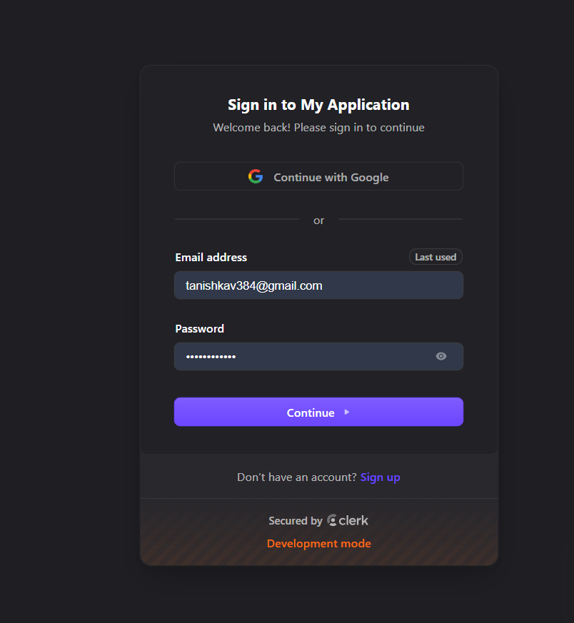
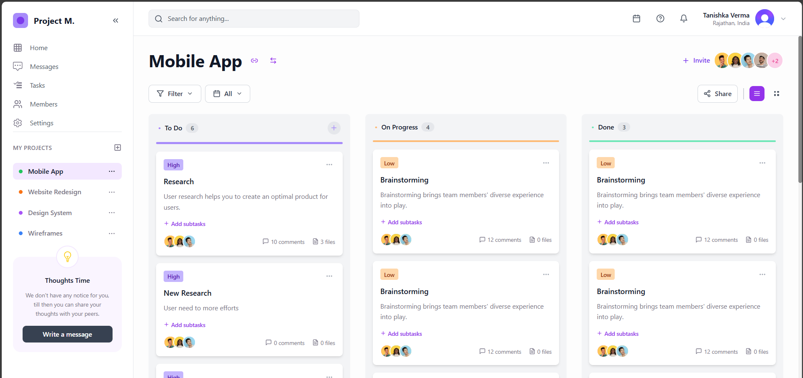
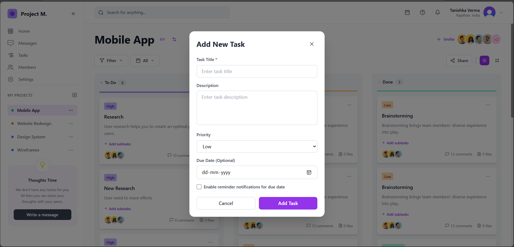
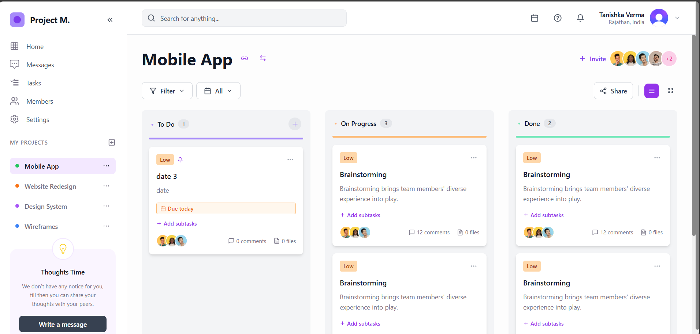
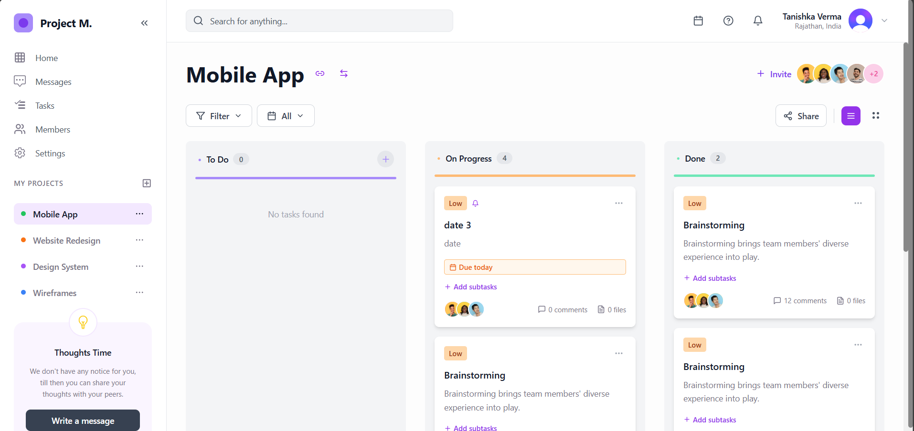
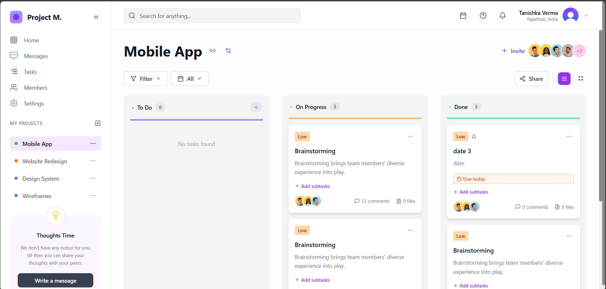
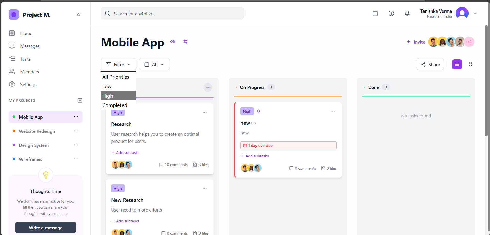
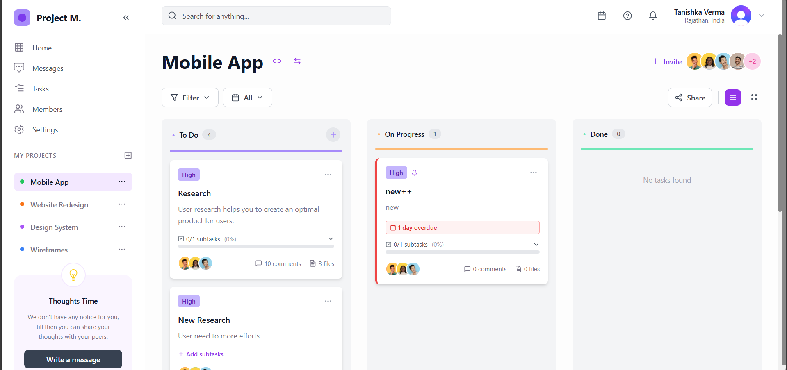

<div align="center">


<a href="https://git.io/typing-svg"></a>

<p align="center">
  
  
  
  
</p>

<p align="center">
  
  
  
</p>


### 📊 Project Highlights

<table>
<tr>
<td align="center" width="25%">
<br/>
<b>⭐ Star-Worthy</b><br/>
<sub>Modern & Beautiful</sub>
</td>
<td align="center" width="25%">
<br/>
<b>🚀 Lightning Fast</b><br/>
<sub>Optimized Performance</sub>
</td>
<td align="center" width="25%">
<br/>
<b>🔒 Secure</b><br/>
<sub>Enterprise Auth0</sub>
</td>
<td align="center" width="25%">
<br/>
<b>📱 Responsive</b><br/>
<sub>Mobile-First Design</sub>
</td>
</tr>
</table>

### 🧭 Quick Navigation

<p align="center">
<a href="#-features">
  
</a>
<a href="#-tech-stack">
  
</a>
<a href="#-screenshots">
  
</a>
<a href="#-installation">
  
</a>
<a href="#-deployment">
  
</a>
</p>


</div>

---

## ✨ Features

<div align="center">

### 🎯 What Makes Creative Upaay Special


</div>

<table>
<tr>
<td width="50%" valign="top">

### 🔐 **Authentication & Security**

 **Enterprise-Grade Protection**

```javascript
✅ Auth0 OAuth 2.0 Integration
✅ Protected Route Guards
✅ JWT Token Management
✅ Automatic Session Refresh
```

 **Why it matters:** Your data is protected with industry-leading security standards

</td>
<td width="50%" valign="top">

### 📋 **Smart Task Management**

 **Complete Task Lifecycle**

```javascript
✅ Rich Text Descriptions
✅ Priority Levels (Low | High | Critical)
✅ Due Dates & Reminders
✅ Real-time Status Updates
```

 **Why it matters:** Manage complex projects with ease and clarity

</td>
</tr>
</table>

<div align="center">

### 🎨 **Interactive Kanban Board**


</div>

<table>
<tr>
<td width="33%" align="center">

#### 📌 **To Do**


**Features:**
- ➕ Quick Add Button
- 📝 Inline Editing
- 📎 Subtask Creation
- 🔍 Smart Filtering
- 📅 Date Selection


</td>
<td width="33%" align="center">

#### ⏳ **In Progress**


**Features:**
- 🔄 Live Updates
- 📊 Progress Tracking
- ⚡ Quick Actions
- 🎯 Priority Management
- ⏱️ Time Tracking


</td>
<td width="33%" align="center">

#### ✅ **Done**


**Features:**
- ✅ Completion Stats
- 📊 Analytics View
- 🔍 History Search
- 🎯 Performance Insights
- 📈 Trends Analysis


</td>
</tr>
</table>

## 📸 Screenshots

<div align="center">

### 🎨 Visual Journey Through Creative Upaay


</div>

### 🔐 **Authentication Pages**

<div align="center">




<br/><br/>

**🔒 Secure Login Page - OAuth 2.0 authentication**

<br/>


</div>

---

<div align="center">


<br/><br/>

**✨ Registration Page - Seamless user onboarding with validation**

<br/>


</div>

---

### 🏠 **Dashboard & Home**

<div align="center">




<br/><br/>

**✨ Main Dashboard - Three-column Kanban board with smooth animations and real-time updates**

<br/>


</div>
---

### ➕ **Task Management**

<div align="center">




<br/><br/>

**🎯 Add Task Modal - Beautiful interface with form validation and auto-save**

<br/>


</div>


<br/><br/>


### 📊 **State Management Views**

<div align="center">




<br/><br/>

**📌 To Do Column - Organized tasks ready to be started**

<br/>


</div>

---

<div align="center">




<br/><br/>

**⏳ In Progress Column - Active tasks being worked on**

<br/>


</div>

---

<div align="center">




<br/><br/>

**✅ Done Column - Completed tasks with analytics**

<br/>


</div>

---


### 🔍 **Filtering System**

<div align="center">




<br/><br/>

**🎯 Advanced Filtering - Multi-criteria filtering with instant results**

<br/>


</div>

---

### 📎 **Subtasks Management**

<div align="center">




<br/><br/>

**📋 Subtasks View - Nested subtasks with progress tracking**

<br/>


</div>

<div align="center">

</div>

---

## 🛠️ Tech Stack

<div align="center">

### 💻 Built With Cutting-Edge Technologies


</div>

### ⚛️ **Core Technologies**

<table>
<tr>
<td align="center" width="20%">
<br/>
<b>React 18.3</b><br/>
<sub>Modern Hooks</sub>
</td>
<td align="center" width="20%">
<br/>
<b>Redux Toolkit</b><br/>
<sub>State Management</sub>
</td>
<td align="center" width="20%">
<br/>
<b>Vite 6.0</b><br/>
<sub>Lightning Build</sub>
</td>
<td align="center" width="20%">
<br/>
<b>Tailwind CSS</b><br/>
<sub>Utility Styles</sub>
</td>
<td align="center" width="20%">
<br/>
<b>Material-UI</b><br/>
<sub>Components</sub>
</td>
</tr>
</table>

### 🔧 **Development Tools**

| Technology | Version | Purpose | Badge |
|:-----------|:--------|:--------|:------|
| **⚛️ React** | 18.3.1 | UI Library with Concurrent Mode |  |
| **🔷 Redux Toolkit** | 2.5.0 | Predictable State Container |  |
| **⚡ Vite** | 6.0.5 | Next Generation Build Tool |  |
| **🎨 TailwindCSS** | 3.4.17 | Utility-First CSS Framework |  |
| **🎭 Material-UI** | 6.4.0 | React Component Library |  |
| **🔐 Auth0** | 2.2.4 | Authentication Platform |  |
| **🛣️ React Router** | 7.1.3 | Declarative Routing |  |
| **📅 Day.js** | 1.11.13 | 2KB Immutable Date Library |  |
| **🎨 React Icons** | 5.4.0 | Popular Icon Packs |  |

<div align="center">

</div>

<p align="center">
  
</p>

<p align="center">
  <sub>Built with ❤️ using React, Redux, and lots of determination</sub>
</p>


</div>
